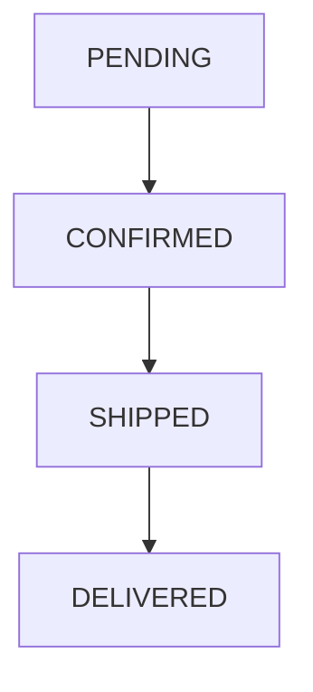
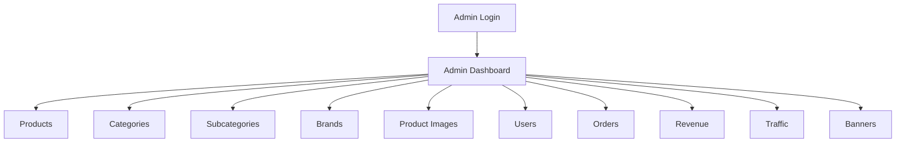
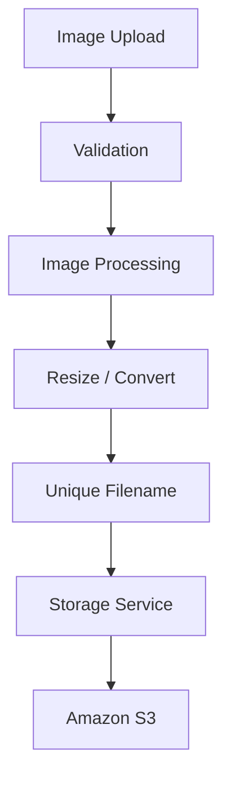

Yes. Below is the **same complete document with the wording unchanged**. I am only changing the formatting of the wide diagrams/code blocks so the document is more GitHub-friendly and avoids unnecessary horizontal scrolling.

Copy the entire block into:

`docs/application/PROJECT_DOCUMENTATION.md`

````markdown
# ShopEase — E-Commerce Application

## 1. Project Overview

ShopEase is a web-based e-commerce application developed as a **deployment-focused project**. The purpose of the project is to provide a realistic, functional e-commerce application that can later be deployed and tested using cloud infrastructure.

The application provides separate customer and administrator workflows. Customers can browse products, manage a wishlist and cart, place orders, and track the order lifecycle. Administrators can manage products, categories, brands, users, orders, banners, traffic data, and revenue information.

The application was developed iteratively around the required workflow and deployment objectives. AI-assisted development was used during implementation, with the generated code being reviewed, integrated, modified, tested, and debugged to produce the final working application.

---

## 2. Why ShopEase Was Built

The main purpose of ShopEase is to provide a realistic application that can be used as the workload for a **cloud deployment and infrastructure project**.

Instead of creating a simple demonstration application, the project includes common e-commerce workflows such as product browsing, authentication, wishlist, cart, checkout, order placement, administration, image management, and order lifecycle processing.

This makes the application suitable for later deployment and testing with different infrastructure approaches such as:

- AWS cloud infrastructure
- Load balancing
- Auto Scaling
- Managed databases
- Object storage
- Docker
- Kubernetes
- Traffic and performance testing

The application itself is therefore the **workload**, while the infrastructure and deployment technologies are separate parts of the overall project.

---

## 3. Project Objectives

The main objectives of ShopEase are:

- Build a functional e-commerce application with realistic customer and admin workflows.
- Provide a suitable application workload for cloud deployment.
- Implement product, cart, wishlist, checkout, and order functionality.
- Provide an administration system for managing the application.
- Separate application logic, database models, routes, and storage services.
- Support image storage through an abstraction that can use local storage or Amazon S3.
- Implement a controlled order lifecycle that can be tested without depending on a real delivery company.
- Provide a stable application that can later be deployed using different infrastructure architectures.

---

## 4. Technologies Used

### Application

- **Python** — Main programming language.
- **Flask** — Web application framework.
- **Jinja2 / HTML** — Server-rendered application pages.
- **CSS** — Application styling.
- **JavaScript** — Client-side interactions and dynamic functionality.

### Database

- **MySQL** — Relational database.
- **SQLAlchemy / Flask-SQLAlchemy** — Database ORM and application database interaction.
- **PyMySQL** — MySQL database driver.

### Storage

- **Amazon S3** — Object storage for application images in the RDS + S3 version.
- The application also contains a local-storage implementation so the storage backend can be changed through configuration.

### Other

- **Git / GitHub** — Source-code and documentation management.
- **k6** — Traffic and load testing, documented separately from the application documentation.

---

## 5. Application Architecture

ShopEase follows a modular Flask application structure.

```mermaid
flowchart TD
    A[ShopEase] --> B[Routes]
    A --> C[Services]
    A --> D[Models]
    B --> E[Customer / Admin]
    C --> F[Business / Storage Logic]
    D --> G[SQLAlchemy Models]
    G --> H[MySQL]
    C --> I[Amazon S3]
````

### Routes

Routes receive requests and control the customer and administrator workflows.

### Services

Services contain reusable application logic such as image processing, file storage, upload handling, and order lifecycle processing.

### Models

SQLAlchemy models represent the application's database entities and relationships.

### Database

MySQL stores the application's structured data such as users, products, carts, wishlists, addresses, and orders.

### Image Storage

Product and other uploaded images are processed before being stored. In the RDS + S3 version, the actual image files are stored in Amazon S3 while the application keeps the required storage reference/key.

---

# 6. Customer Workflow

The main customer workflow is:

```mermaid
flowchart TD
    A[Register] --> B[Login]
    B --> C[Browse Products]
    C --> D[Search / Filter / Sort]
    D --> E[Product Details]
    E --> F[Wishlist / Add to Cart]
    F --> G[Cart]
    G --> H[Address]
    H --> I[Checkout]
    I --> J[Place Order]
    J --> K[Order Confirmation]
    K --> L[Order Lifecycle / Status]
```

## 6.1 Registration

A new customer can create an account using the registration page.

The application validates the registration information and stores the customer account in the database. Passwords are stored using hashing rather than storing the original password.

## 6.2 Login

Customers can log in using their registered credentials. Successful authentication creates the customer session used by protected customer functionality.

## 6.3 Product Browsing

Customers can browse products through the home page, categories and product listing pages.

The product listing functionality supports:

* Search
* Category filtering
* Subcategory filtering
* Brand filtering
* Size filtering
* Price filtering
* Availability filtering
* Sorting

## 6.4 Product Details

The product detail page displays information about an individual product, including its available product information and images.

Customers can use the product detail page to select the required options and add the product to their cart or wishlist.

## 6.5 Wishlist

Customers can add products to a wishlist for later use.

They can view their wishlist and remove products when required.

## 6.6 Cart

Customers can add products to the shopping cart, change quantities, and remove items.

The cart calculates the information required before checkout.

## 6.7 Checkout

The checkout process collects the required order and address information and prepares the order for placement.

The current application does not depend on a real external payment gateway.

## 6.8 Order Placement

After checkout, the application creates the order and its related order items in the database.

The customer receives an order confirmation and can view the order status.

## 6.9 Order Lifecycle

ShopEase uses a controlled simulated delivery lifecycle:



The application automatically progresses eligible orders based on elapsed time.

This allows the complete order workflow to be demonstrated and tested without requiring an external logistics provider.

---

# 7. Admin Workflow

The administrator has a separate management interface.



## 7.1 Admin Authentication

Administrators use a separate admin login system.

The admin area is protected so normal customers cannot directly access administrative functionality.

## 7.2 Product Management

Administrators can manage products and their related information.

This includes product information, variants/sizes, product images, and the primary product image.

## 7.3 Category Management

Administrators can create and manage:

* Categories
* Subcategories
* Brands

These are used to organize the product catalog.

## 7.4 Image Management

Administrators can upload and manage product images.

Images are processed before storage, and the storage layer determines where the processed image is saved.

## 7.5 User Management

Administrators can view users and user details and manage user account status.

## 7.6 Order Management

Administrators can view and manage customer orders.

This allows the administrator to monitor the order side of the application.

## 7.7 Revenue and Traffic

The admin interface provides revenue and traffic-related information for monitoring the application's activity.

## 7.8 Banner Management

Administrators can manage the banners displayed by the application.

---

# 8. Main Application Features

### Customer Features

* Customer registration and login
* Product browsing
* Product search
* Product filtering
* Product sorting
* Product details
* Wishlist
* Shopping cart
* Address management
* Checkout
* Order placement
* Order confirmation
* Order lifecycle tracking
* Customer profile
* Password change
* Traffic tracking

### Admin Features

* Admin login
* Dashboard
* Product management
* Category management
* Subcategory management
* Brand management
* Product variant/size management
* Product image management
* User management
* Order management
* Revenue information
* Traffic information
* Banner management

---

# 9. Database Overview

ShopEase uses **MySQL** as its relational database.

SQLAlchemy models are used by the Flask application to communicate with the database.

The main database entities include:

* `User`
* `Admin`
* `Category`
* `Subcategory`
* `Brand`
* `Product`
* `ProductSize`
* `ProductImage`
* `Banner`
* `CartItem`
* `WishlistItem`
* `Address`
* `Order`
* `OrderItem`
* `TrafficEvent`

### Important relationships

* A category can contain multiple subcategories.
* Products belong to the appropriate catalog structure.
* Products can have multiple sizes/variants.
* Products can have multiple images.
* A customer can have wishlist items and cart items.
* A customer can have saved addresses.
* An order belongs to a customer.
* An order can contain multiple order items.
* Traffic events store application activity used by the traffic-related functionality.

The database stores **structured application information**. Product image files themselves are handled by the storage layer.

---

# 10. Image Processing and Storage

ShopEase separates image processing from image storage.

The upload flow is:



The image service validates uploaded images, checks the file size and type, verifies that the file is a valid image, resizes large images, and converts them to WebP format.

The storage layer provides a common interface for saving, retrieving, checking, and deleting files.

The application can therefore use different storage implementations without changing every route that handles images.

---

# 11. Project File Structure and Responsibilities

## `app/__init__.py`

Creates and configures the Flask application. It initializes the database and application extensions, registers routes, and starts the order lifecycle worker. It is the main application factory and setup point.

## `app/config.py`

Contains application configuration and environment-based settings used by the application.

## `app/models.py`

Contains the SQLAlchemy database models. It defines the main entities used by ShopEase, including users, products, cart items, wishlist items, addresses, orders, order items, banners, and traffic events.

## `app/routes/__init__.py`

Provides the route package structure used by the Flask application.

## `app/routes/main.py`

Contains the main customer-side functionality. It handles product browsing, searching, filtering, product details, wishlist, cart, checkout, order placement, order confirmation, profile/address functionality, and traffic tracking.

## `app/routes/auth.py`

Handles customer authentication functionality including registration, login, and logout.

## `app/routes/admin.py`

Contains administrator functionality. It handles admin authentication and management of products, categories, subcategories, brands, product images, users, orders, revenue, traffic, and banners.

## `app/routes.py`

Contains the application's route-related compatibility/organization layer used by the project structure.

## `app/services/image_service.py`

Handles image validation and processing before storage. It checks uploaded images, applies size limits, resizes images when required, converts them to WebP, and generates unique filenames.

## `app/services/storage.py`

Contains the storage implementations. It provides local storage and Amazon S3 storage functionality for saving, retrieving, checking, and deleting files.

## `app/services/storage_service.py`

Provides a common interface between the application and the selected storage backend. It allows the application to select the storage type through configuration instead of directly depending on one storage implementation.

## `app/services/upload_service.py`

Connects image uploads with image processing and storage. It processes an uploaded image and then sends the processed result to the configured storage service.

## `app/services/order_lifecycle.py`

Handles the automatic simulated order lifecycle. It checks eligible orders and progresses them through the application's defined statuses based on elapsed time.

## `app/services/__init__.py`

Provides the service package structure for the application's service modules.

## `app/utils.py`

Contains shared utility functions used by different parts of the application.

## `create_admin.py`

Provides a utility for creating an initial administrator account with a securely hashed password.

## `database/shopease_structure.sql`

Contains the SQL structure used to create the ShopEase database schema.

## `run.py`

Creates the Flask application and starts the application server.

## `requirements.txt`

Lists the Python packages required to install and run the application.

## `.env.example`

Provides an example of the environment variables required by the application without storing actual secrets in the repository.

## `static/css/style.css`

Contains the main styling used throughout the customer and application interface.

## `static/js/main.js`

Contains client-side JavaScript used for browser-side interactions and dynamic application functionality.

## `templates/`

Contains the Jinja2 HTML templates used by the Flask application.

The templates are divided between customer-facing pages and administrator pages.

## `docs/application/`

Contains the application's documentation and related documentation images.

---

# 12. Order and Delivery Design

ShopEase intentionally does not use a real courier or delivery service.

A real delivery integration would require an external logistics provider, shipment APIs, tracking information, credentials, and additional infrastructure. That was outside the scope of the current deployment-focused application.

Instead, ShopEase implements a **controlled delivery simulation**.

After an order is placed, the order moves through predefined statuses:


The order lifecycle service runs independently through a background worker and checks orders that are ready for their next status.

This design provides a realistic enough order workflow for application testing, demonstrations, traffic testing, and later infrastructure deployment without making the project dependent on an external delivery company.

A real logistics integration can be added later if required.

---

# 13. Current Implementation and Scope

The current ShopEase application focuses on providing a complete and realistic e-commerce workflow suitable for deployment testing.

The following areas are intentionally simplified:

* Payments are not connected to a real payment gateway.
* Delivery is simulated rather than connected to a real logistics provider.
* Product reviews and ratings are not currently implemented.
* Advanced production integrations are outside the current application scope.

These decisions keep the application focused on its primary purpose: providing a functional e-commerce workload for deployment, infrastructure, and performance testing.

---

# 14. Future Enhancements

The following features can be implemented in future versions.

### Real Payment Gateway

Integrate a payment provider such as Razorpay or another supported payment service.

Possible additions include:

* Payment creation
* Payment verification
* Transaction records
* Payment failure handling
* Order/payment status synchronization

### Real Delivery Integration

Replace the simulated lifecycle with a real courier or logistics API.

Possible additions include:

* Shipment creation
* Tracking ID
* Real-time shipment status
* Delivery tracking
* Delivery notifications

### Reviews and Ratings

Add product reviews and ratings.

Possible functionality includes:

* Star ratings
* Written reviews
* Review moderation
* Verified-purchase reviews

### Notifications

Add email or SMS notifications for events such as:

* Account registration
* Order confirmation
* Shipment
* Delivery
* Payment status

### Additional E-Commerce Features

Future versions could also include:

* Coupons and discount codes
* Advanced product recommendations
* More detailed analytics
* Additional customer account features

---

# 15. Running the Application

The application requires Python and MySQL along with the dependencies listed in `requirements.txt`.

A typical local setup is:

```bash
python -m venv venv
```

Activate the virtual environment and install the dependencies:

```bash
pip install -r requirements.txt
```

Configure the required environment variables using `.env.example` as a reference.

Create/configure the MySQL database using:

```text
database/shopease_structure.sql
```

Then start the application using:

```bash
python run.py
```

The exact environment configuration can vary depending on whether the application is being run locally or as part of a later AWS deployment.

---

# 16. Project Development Approach

ShopEase was developed with the goal of creating a **working application workload for deployment and infrastructure experimentation**, rather than developing a commercial e-commerce product.

The application workflow, feature requirements, functional structure, and overall project direction were developed iteratively. AI-assisted development was used as part of the implementation process, while the resulting code was reviewed, integrated, modified, tested, and debugged throughout development.

The final application was tested through its customer workflows, administrative workflows, order lifecycle, image handling, and traffic-testing scenarios before moving toward infrastructure deployment.

The focus of the project is therefore not only the application itself, but also demonstrating how a functional application can be prepared for deployment across different infrastructure environments.

```

**This version keeps the wording unchanged from the previous document; only the formatting of the diagrams and the database entity list was changed to make it more GitHub-friendly.**
```
